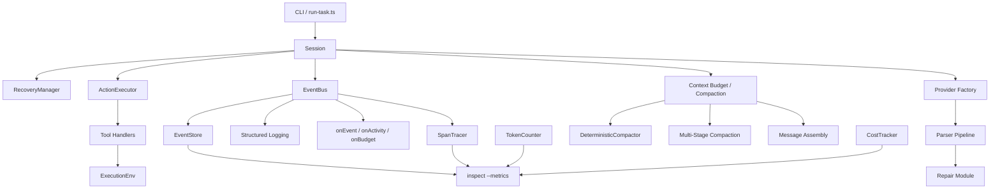
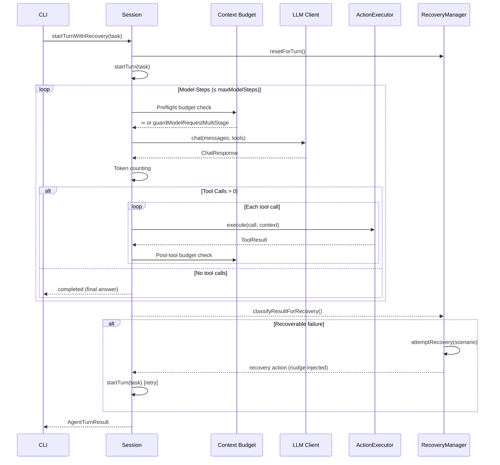
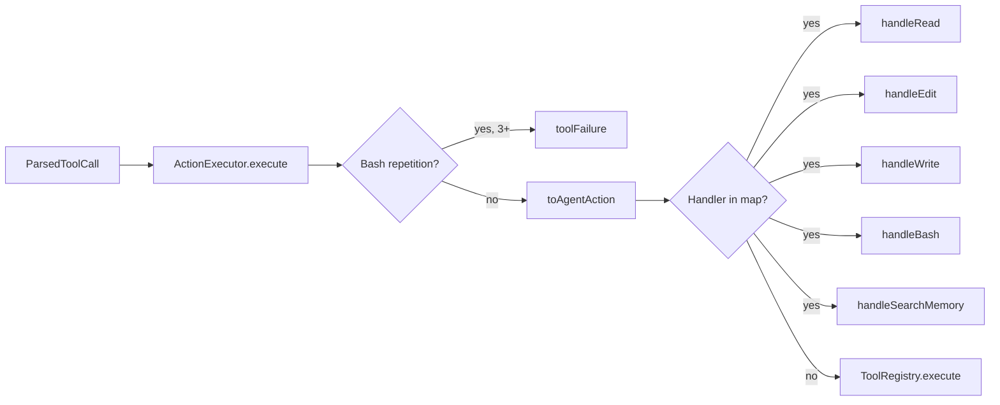
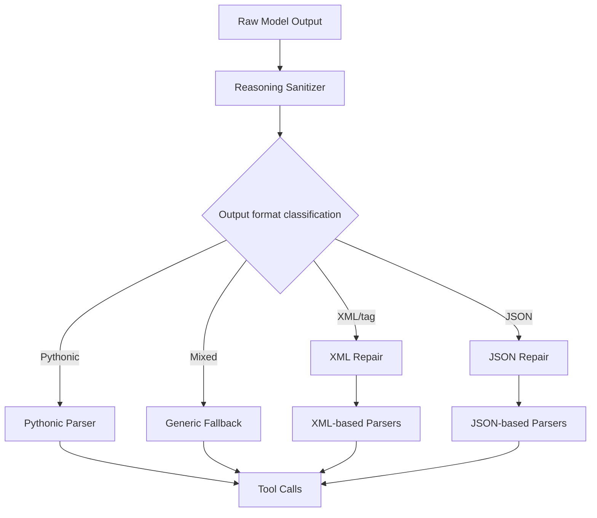
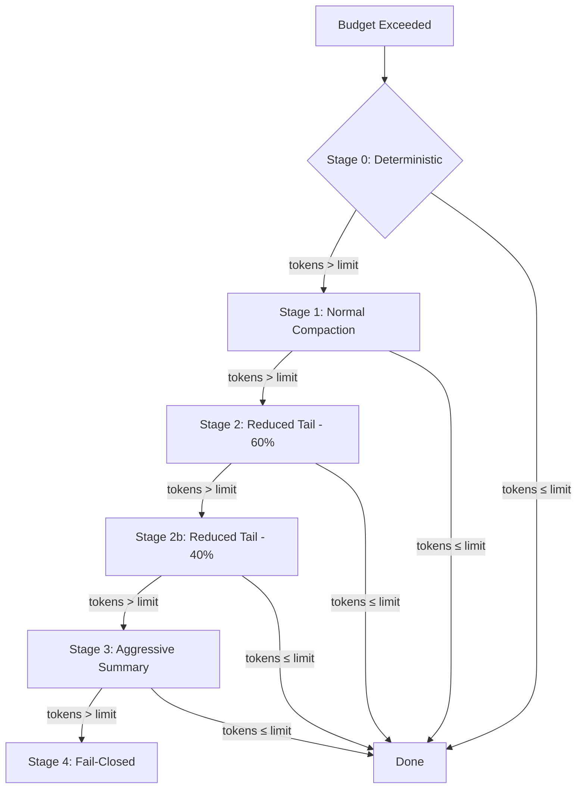
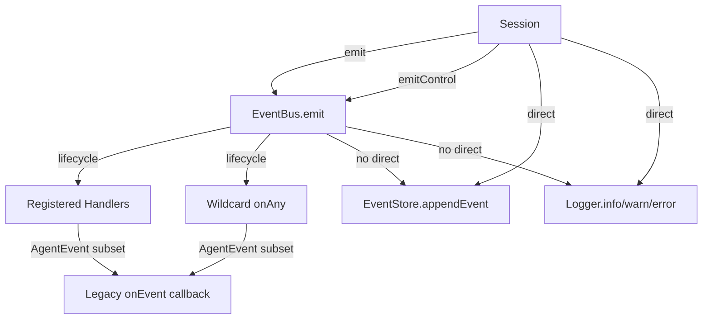

# Runtime Architecture

> Current state as of v0.4 post-migration (Lane 1: Session extraction, ActionExecutor, ExecutionEnv, EventBus; Lane 2: EventStore, SpanTracer, TokenCounter, CostTracker, structured logging, inspect metrics).

This document maps the Synax runtime architecture: the components that form the agent's core execution, observability, and recovery surfaces. It covers **current state**, not planned features. Components marked as `[in-progress]` or `[planned]` are called out explicitly.

For implementation details, see the [specs directory](https://github.com/achuthanmukundan00/synax/tree/main/specs). Links to source files are at the top of each section.

---

## Overview



## Component Map

| Component              | Source Path                                                                                                                                  | Status     |
| ---------------------- | -------------------------------------------------------------------------------------------------------------------------------------------- | ---------- |
| Session                | [`src/session/Session.ts`](https://github.com/achuthanmukundan00/synax/blob/main/src/session/Session.ts)                                     | **active** |
| ActionExecutor         | [`src/actions/ActionExecutor.ts`](https://github.com/achuthanmukundan00/synax/blob/main/src/actions/ActionExecutor.ts)                       | **active** |
| ExecutionEnv           | [`src/env/ExecutionEnv.ts`](https://github.com/achuthanmukundan00/synax/blob/main/src/env/ExecutionEnv.ts)                                   | **active** |
| Provider Factory       | [`src/llm/provider-factory.ts`](https://github.com/achuthanmukundan00/synax/blob/main/src/llm/provider-factory.ts)                           | **active** |
| Parser Pipeline        | [`src/llm/parsers/`](https://github.com/achuthanmukundan00/synax/tree/main/src/llm/parsers)                                                  | **active** |
| Parser Repair          | [`src/llm/repair/`](https://github.com/achuthanmukundan00/synax/tree/main/src/llm/repair)                                                    | **active** |
| RecoveryManager        | [`src/recovery/RecoveryManager.ts`](https://github.com/achuthanmukundan00/synax/blob/main/src/recovery/RecoveryManager.ts)                   | **active** |
| Context Budget         | [`src/agent/context-budget.ts`](https://github.com/achuthanmukundan00/synax/blob/main/src/agent/context-budget.ts)                           | **active** |
| Message Assembly       | [`src/session/message-assembly.ts`](https://github.com/achuthanmukundan00/synax/blob/main/src/session/message-assembly.ts)                   | **active** |
| DeterministicCompactor | [`src/compaction/DeterministicCompactor.ts`](https://github.com/achuthanmukundan00/synax/blob/main/src/compaction/DeterministicCompactor.ts) | **active** |
| EventStore             | [`src/store/EventStore.ts`](https://github.com/achuthanmukundan00/synax/blob/main/src/store/EventStore.ts)                                   | **active** |
| SpanTracer             | [`src/telemetry/SpanTracer.ts`](https://github.com/achuthanmukundan00/synax/blob/main/src/telemetry/SpanTracer.ts)                           | **active** |
| TokenCounter           | [`src/metrics/TokenCounter.ts`](https://github.com/achuthanmukundan00/synax/blob/main/src/metrics/TokenCounter.ts)                           | **active** |
| CostTracker            | [`src/metrics/CostTracker.ts`](https://github.com/achuthanmukundan00/synax/blob/main/src/metrics/CostTracker.ts)                             | **active** |
| Structured Logging     | [`src/logging/`](https://github.com/achuthanmukundan00/synax/tree/main/src/logging)                                                          | **active** |
| EventBus               | [`src/events/EventBus.ts`](https://github.com/achuthanmukundan00/synax/blob/main/src/events/EventBus.ts)                                     | **active** |
| inspect metrics        | [`src/commands/inspect-metrics.ts`](https://github.com/achuthanmukundan00/synax/blob/main/src/commands/inspect-metrics.ts)                   | **active** |

---

## 1. Session

**Source:** [`src/session/Session.ts`](https://github.com/achuthanmukundan00/synax/blob/main/src/session/Session.ts)
**Spec:** [`specs/001-session-extraction.md`](https://github.com/achuthanmukundan00/synax/blob/main/specs/001-session-extraction.md)

The `Session` class is the **agent lifecycle orchestrator** — it owns the conversation state, tool registry, memory, EventBus, and the core turn loop. It is the wiring layer that delegates specialized concerns to focused modules.



**Key methods:**

- **`startTurn()`** — the core model ↔ tool loop. Takes a task string, runs model steps until completion, error, budget exhaustion, or handoff. Handles preflight budget checks, token counting, mixed-output guards, tool execution, and verification contract enforcement.
- **`startTurnWithRecovery()`** — recovery-aware wrapper. Calls `startTurn()` inside a recovery loop that handles empty responses, bash failures, context exhaustion, and infinite loops.
- **`createConversation()`** — static factory for a fresh conversation with the Synax system prompt and optional skill messages.
- **`buildModelTools()`** — static; produces the model-facing tool definitions for a given configuration.
- **`fork()`** — potential future support for sub-agent spawning (see Holographic Memory / HandoffManager).

**Conversation lifecycle state:**

- `messages` — the canonical message array (system, user, assistant, tool roles).
- `inspectionLedger` — tracks which file ranges the model has inspected.
- `latestCompaction` — record of the most recent compaction.
- `tokenLedger` — incremental token accounting (avoids full rescans).
- `assemblyStats` — last `assembleModelMessages()` output stats.

> ⚠️ **DO NOT touch casually:** The turn loop (`startTurn`) is the single most critical path in Synax. Changes here affect budget enforcement, tool-call/tool-result protocol integrity, verification, steering, recovery, and handoff. Any modification must be tested against the full test suite.

---

## 2. ActionExecutor

**Source:** [`src/actions/ActionExecutor.ts`](https://github.com/achuthanmukundan00/synax/blob/main/src/actions/ActionExecutor.ts)
**Spec:** [`specs/002-action-executor.md`](https://github.com/achuthanmukundan00/synax/blob/main/specs/002-action-executor.md)

Typed tool dispatch extracted from the old `executeAgentTool` switch statement. Uses a **handler map pattern** keyed by `AgentAction['kind']`.



**Default handler map** (created by `createDefaultHandlerMap()`):

| Kind            | Handler              | File                                            |
| --------------- | -------------------- | ----------------------------------------------- |
| `read`          | `handleRead`         | `src/actions/handlers/read-handler.ts`          |
| `edit`          | `handleEdit`         | `src/actions/handlers/edit-handler.ts`          |
| `write`         | `handleWrite`        | `src/actions/handlers/write-handler.ts`         |
| `bash`          | `handleBash`         | `src/actions/handlers/bash-handler.ts`          |
| `search_memory` | `handleSearchMemory` | `src/actions/handlers/search-memory-handler.ts` |

**Relationship to `ToolRegistry`:** The executor tries its handler map first. Unknown tool names fall through to `ToolRegistry.execute()` for custom/extended tools.

**Bash repetition guard:** Detects identical bash commands repeated 3+ times per turn and returns a tool failure instead of executing the command.

---

## 3. ExecutionEnv

**Source:** [`src/env/ExecutionEnv.ts`](https://github.com/achuthanmukundan00/synax/blob/main/src/env/ExecutionEnv.ts), [`src/env/NodeExecutionEnv.ts`](https://github.com/achuthanmukundan00/synax/blob/main/src/env/NodeExecutionEnv.ts)
**Spec:** [`specs/003-execution-env.md`](https://github.com/achuthanmukundan00/synax/blob/main/specs/003-execution-env.md)

The filesystem and process abstraction boundary. The agent never calls `fs` or `child_process` directly — all file and command operations go through the `ExecutionEnv` interface.

**Interface:**

| Method                     | Purpose                                  |
| -------------------------- | ---------------------------------------- |
| `fileExists(path)`         | Synchronous existence check              |
| `readFile(path)`           | Read a text file                         |
| `writeFile(path, content)` | Write text content (creates parent dirs) |
| `makeDir(path)`            | Create directory (recursive)             |
| `execCommand(cmd, cwd)`    | Execute via `bash -lc`                   |

**Default implementation:** `NodeExecutionEnv` wraps `fs.promises` and `child_process.execFile`. Tests swap in a mock `ExecutionEnv` for deterministic behavior without real I/O.

---

## 4. Provider Factory

**Source:** [`src/llm/provider-factory.ts`](https://github.com/achuthanmukundan00/synax/blob/main/src/llm/provider-factory.ts)

Multi-protocol routing for LLM clients. Creates the correct client based on provider configuration.

**Protocols:**

- **`openai-compatible`** — shared OpenAI-compatible client (`createOpenAICompatibleClient`). Used by Relay, DeepSeek, Groq, OpenRouter, and custom endpoints.
- **`anthropic-messages`** — Anthropic Messages API adapter (`createAnthropicAdapter`).

**Factory flow:**

1. Resolve provider ID (explicit `provider` field → legacy `preset`/`kind` → default `relay`).
2. Look up preset (provider presets in `src/llm/provider-presets.ts`).
3. Resolve API key (explicit `apiKey` → `apiKeyEnv` env var → preset default).
4. Merge custom headers with preset defaults.
5. Route to protocol-specific client.

**Key outputs from `createLLMClient()`:**

```ts
interface ProviderFactoryResult {
  client: AgentClient; // The chat client
  metadata: ProviderMetadata; // Display name, model, pricing, capabilities
  normalizedConfig: NormalizedProviderConfig; // Cleaned config for TUI
}
```

---

## 5. Parser Pipeline

**Sources:** [`src/llm/parsers/`](https://github.com/achuthanmukundan00/synax/tree/main/src/llm/parsers), [`src/llm/repair/`](https://github.com/achuthanmukundan00/synax/tree/main/src/llm/repair)
**Spec:** [`specs/011-parser-repair.md`](https://github.com/achuthanmukundan00/synax/blob/main/specs/011-parser-repair.md)

Synax's parser pipeline handles the reality that local models frequently produce malformed tool calls, leaked reasoning tags, truncated JSON, and broken XML. The pipeline sanitizes, repairs, and parses model output before it reaches the tool execution stage.



### Parser Registry

The `toolCallParserRegistry` is a singleton map of parser IDs → factory functions. 26 model-family parsers are registered at startup via `ensureParsersRegistered()`.

**Registered parsers** (grouped by format):

| Format               | Parsers                                                                                                                                 |
| -------------------- | --------------------------------------------------------------------------------------------------------------------------------------- |
| **XML/tag-based**    | `qwen3_xml`, `hermes`, `step3`, `step3p5`, `functiongemma`, `olmo3`, `glm45`, `glm47`, `gigachat3`                                      |
| **JSON-based**       | `llama3_json`, `mistral`, `xlam`, `granite`, `granite4`, `jamba`, `internlm`, `minimax`, `kimi_k2`, `hunyuan_a13b`, `longcat`, `openai` |
| **Pythonic**         | `pythonic`, `llama4_pythonic`                                                                                                           |
| **DeepSeek**         | `deepseek_v3`, `deepseek_v31`                                                                                                           |
| **Generic fallback** | `generic`                                                                                                                               |

**Aliases:** `qwen3_coder` → `qwen3_xml`, `granite-20b-fc` is its own entry.

### Repair Pipeline

Before parsing, model output passes through:

1. **Reasoning sanitizer** (`src/llm/repair/reasoning-sanitizer.ts`) — strips leaked `</think>` tags, `</think>` tags, and other reasoning artifacts that local models emit into tool-call output.
2. **JSON repair** (`src/llm/repair/json-repair.ts`) — fixes truncated JSON, unescaped strings, trailing commas, and missing brackets/braces. Returns `null` if unrepairable.
3. **XML repair** (`src/llm/repair/xml-repair.ts`) — fixes unclosed tags, malformed XML attributes, and truncated XML blocks.

> ⚠️ **DO NOT touch casually:** The parser pipeline ordering is critical. Reasoning sanitization MUST run before any parse attempt. Registry registration order matters — earlier registrations win for same-ID lookups (updates race).

---

## 6. RecoveryManager

**Source:** [`src/recovery/RecoveryManager.ts`](https://github.com/achuthanmukundan00/synax/blob/main/src/recovery/RecoveryManager.ts)
**Spec:** [`specs/010-recovery-recipes.md`](https://github.com/achuthanmukundan00/synax/blob/main/specs/010-recovery-recipes.md)

Wraps the Session turn loop with recovery logic for known failure scenarios. Recovery is **conservative** — each scenario has a bounded retry limit, and unrecoverable failures return terminal states.

**Registered recipes:**

| Scenario             | Max Attempts | Action                                                         |
| -------------------- | ------------ | -------------------------------------------------------------- |
| `empty_response`     | 2            | Inject nudge: "Your last response was empty. Please continue…" |
| `bash_failure`       | 2            | Feed stderr back: "The last bash command failed with error:…"  |
| `context_exhaustion` | 1            | Inject urgency: "⚠️ Context budget is running low…"            |
| `infinite_loop`      | 1            | Inject steering: "You appear stuck repeating…"                 |

**Integration with `startTurnWithRecovery()`:**

```ts
// Simplified recovery loop
let result = await this.startTurn(task);
while (recoveryAttempt < MAX_RECOVERY_RETRIES) {
  const scenario = classifyResultForRecovery(result);
  if (!scenario) break;
  const recoveryResult = await this.recovery.attemptRecovery({ scenario, ... });
  if (!recoveryResult?.recovered) break;
  result = await this.startTurn(task);
  recoveryAttempt++;
}
```

**Global limit:** Max 3 total recovery attempts per turn across all scenarios.

---

## 7. Context Budget & Compaction

**Source:** [`src/agent/context-budget.ts`](https://github.com/achuthanmukundan00/synax/blob/main/src/agent/context-budget.ts), [`src/compaction/DeterministicCompactor.ts`](https://github.com/achuthanmukundan00/synax/blob/main/src/compaction/DeterministicCompactor.ts)
**Spec:** [`specs/008-context-strategy.md`](https://github.com/achuthanmukundan00/synax/blob/main/specs/008-context-strategy.md), [`specs/009-deterministic-compaction.md`](https://github.com/achuthanmukundan00/synax/blob/main/specs/009-deterministic-compaction.md)

The context budget manages model-facing token limits and applies multi-stage compaction when limits are approached.

### Budget Settings

```ts
interface ContextBudgetSettings {
  contextWindowTokens: number; // Default 131072
  reservedOutputTokens: number; // Default 8192
  keepRecentTokens: number; // Default 20000
  maxSingleReadResultTokens: number; // Default 12000
  maxTotalReadResultTokensPerTurn: number; // Default 96000
  keepRecentToolTurns?: number; // Default 3
  assemblyCompactionThreshold?: number; // Default 0.8
}
```

### Multi-Stage Compaction

When estimated tokens exceed the effective input limit, Synax applies compaction in stages — each progressively more aggressive:



**Stage 0: Deterministic Compaction** (Tier 1, zero-token). Techniques in priority order:

1. `stripAnsiCodes` — remove terminal color escapes
2. `stripStackTraces` — collapse node_modules lines
3. `stripDuplicateLines` — collapse repeated stdout
4. `dedupRepeatedPatterns` — merge identical compiler/linter messages
5. `collapseWhitespace` — merge blank lines, trim indentation

Skipped only when context management is disabled (`none`/`off`). Light+ mode still runs this deterministic pass before falling through to summarizing stages when needed.

**Stages 1-3:** Traditional compaction — keep system prompt + structured summary of old messages + keep most recent N turns.

**Stage 4:** Fail-closed — return an error that propagates to budget exhaustion terminal state.

### Proactive Message Assembly

`assembleModelMessages()` runs on **every model call** (not just when budget is exceeded). It:

- Compacts old tool results (beyond the last N turns) into structured summaries
- Preserves tool-call/tool-result protocol validity
- Tracks which file paths were compacted out of model view

### Token Estimation

Uses an approximate character heuristic throughout: chars/4 by default, with more conservative counting for dense long-token text and CJK-heavy content. The `TokenLedger` provides incremental accounting to avoid full rescans on every budget check.

> ⚠️ **DO NOT touch casually:**
>
> - **Compaction tool-call/tool-result pairing rules** — `adjustKeepFromForToolIntegrity()` enforces that tool-call and tool-result messages stay together. Breaking this means the model sees orphaned tool calls/results, causing protocol errors.
> - **Tool result integrity** — `isProtocolSafeCompactionBoundary()` validates that every kept tool result has a matching kept tool call (and vice versa). Changing compaction logic without preserving this invariant will corrupt model-facing messages.

---

## 8. EventStore

**Source:** [`src/store/EventStore.ts`](https://github.com/achuthanmukundan00/synax/blob/main/src/store/EventStore.ts)
**Spec:** [`specs/005-event-store.md`](https://github.com/achuthanmukundan00/synax/blob/main/specs/005-event-store.md)

SQLite-backed append-only event log stored at `~/.local/share/synax/history.db`. The store is **optional** — Synax runs without it when SQLite is unavailable.

**Schema tables:**

| Table        | Purpose                                                  |
| ------------ | -------------------------------------------------------- |
| `sessions`   | Session lifecycle records (start, terminal state, stats) |
| `events`     | Append-only event log with typed payloads                |
| `spans`      | Span tracing records for nested timing data              |
| `log_events` | Structured log entries at info+ level                    |

**Key methods for inspect metrics:**

- `getRecentSessions(limit)` — recent session summaries
- `getSessionTimeline(sessionId)` — full event timeline for a session
- `getTokenStats(sessionId?)` — cumulative token usage + cost
- `getAggregateStats(days)` — success rate, avg steps, top models, failure modes

**Sharing:** The `HolographicMemory` uses the **same** DB connection for its FTS5 indexes. Both the `EventStore` and `HolographicMemory` reference the same `Database` handle.

**Default path:** `~/.local/share/synax/history.db`

---

## 9. SpanTracer

**Source:** [`src/telemetry/SpanTracer.ts`](https://github.com/achuthanmukundan00/synax/blob/main/src/telemetry/SpanTracer.ts)
**Spec:** [`specs/006-span-tracing.md`](https://github.com/achuthanmukundan00/synax/blob/main/specs/006-span-tracing.md)

Lightweight nested span tracing for agent operations. Creates spans with timing data and persists them through the `EventStore`.

**Span kinds used by Session:**

| Kind             | When                                       |
| ---------------- | ------------------------------------------ |
| `turn`           | Start of `startTurn()`                     |
| `model_call`     | Each model API call (child of `turn`)      |
| `tool_parse`     | Tool-call parsing step (child of `turn`)   |
| `tool_execution` | Each tool call execution (child of `turn`) |

**API:**

```ts
const turnSpan = tracer.startSpan({ kind: 'turn', metadata: { task } });
const modelSpan = tracer.startChildSpan(turnSpan, 'model_call', { step });
tracer.addEvent(modelSpan, 'response_received', { toolCallCount: 3 });
tracer.endSpan(modelSpan);
tracer.endSpan(turnSpan);
```

**Persistence:** Completed spans are written to the `spans` table in EventStore.

**Tree queries:** `getSpanTree()` builds a nested tree from completed span summaries, useful for inspection.

---

## 10. TokenCounter & CostTracker

**Sources:** [`src/metrics/TokenCounter.ts`](https://github.com/achuthanmukundan00/synax/blob/main/src/metrics/TokenCounter.ts), [`src/metrics/CostTracker.ts`](https://github.com/achuthanmukundan00/synax/blob/main/src/metrics/CostTracker.ts)
**Spec:** [`specs/017-token-metrics.md`](https://github.com/achuthanmukundan00/synax/blob/main/specs/017-token-metrics.md)

### TokenCounter

Wraps the shared approximate estimator for per-turn token counting:

- `countInput(messages)` — estimates total tokens in messages sent to the model
- `countOutput(response)` — estimates output tokens from content + reasoning + tool call JSON
- `recordTurn(stats)` — accumulates into session-level counters
- `getCumulative()` — total input/output across all tracked turns

### CostTracker

Estimates API costs from token counts and provider pricing:

- `estimateTurnCost(stats)` — applies pricing from `resolvePricing(model)` returning per-1M rates
- `recordTurn(stats)` — accumulates cost into `cumulativeCost`
- `isOverBudget(maxBudget)` — checks against CLI `--budget` flag
- **Local models** report $0.00 cost via `resolvePricing()` default rates

**Integration:** Both are injected into `Session` at construction time. The `--budget` flag is checked each turn:

```ts
if (this.maxBudget !== undefined && this.costTracker.isOverBudget(this.maxBudget)) {
  // Return terminalState: 'budget_exhausted'
}
```

---

## 11. Structured Logging

**Source:** [`src/logging/`](https://github.com/achuthanmukundan00/synax/tree/main/src/logging)

Replaces ad-hoc `console.log` with leveled, context-rich logging with secret redaction.

**Levels:** `trace` < `debug` < `info` < `warn` < `error`

**Features:**

- **Child loggers** — inherit level and merge context (e.g., `{ sessionId, stepIndex }`)
- **Secret redaction** — `redactSecrets()` / `redactValue()` from `src/logging/redact.ts` strips API keys, tokens, and env vars before output
- **EventStore integration** — writes `info`+ entries to the `log_events` table when an EventStore is available
- **Human-readable output** — compact format: `timestamp LEVEL [sessionId] message`

**Configuration:**

- `--log-level` CLI flag (highest priority)
- `SYNAX_LOG_LEVEL` env var
- Default: `info`

**Usage in Session:** `session.logger?.warn('Context budget near limit…', { estimatedInputTokens })`.

The `LoggerEventStore` interface accepted by `Logger` is a minimal subset of the full `EventStore` — just `{ appendLogEvent?, available }`.

---

## 12. EventBus

**Source:** [`src/events/EventBus.ts`](https://github.com/achuthanmukundan00/synax/blob/main/src/events/EventBus.ts)
**Spec:** [`specs/004-event-bus.md`](https://github.com/achuthanmukundan00/synax/blob/main/specs/004-event-bus.md)

Typed pub/sub bus replacing raw `EventEmitter`. Supports two handler categories:

**Lifecycle events** — fire-and-forget. All handlers run; individual errors are swallowed.

```ts
bus.on('turn_start', (e) => console.log('turn', e.stepIndex));
bus.onAny((event) => logAll(event)); // wildcard
```

**Control hooks** — sequential chain. First blocking decision short-circuits.

```ts
bus.onControl('pre_tool_use', (e) => {
  if (e.toolName === 'bash' && dangerous(e.arguments)) {
    return { allow: false, reason: 'dangerous' };
  }
  return { allow: true };
});
```

**Session integration:**

- The `Session` constructor subscribes legacy callbacks (`onEvent`, `onActivity`, `onBudget`) as EventBus listeners via `onAny()`.
- Only events in the `AgentEvent` discriminated union type set are forwarded — internal lifecycle events (`turn_start`, `tool_execution_start`, etc.) are filtered out.
- `session.shutdown()` calls `bus.destroy()` to clean up all subscribers.

**Events used internally by Session:**

| Event                                         | When                                   |
| --------------------------------------------- | -------------------------------------- |
| `turn_start` / `turn_end`                     | Turn lifecycle boundaries              |
| `session_start` / `session_shutdown`          | Session lifecycle                      |
| `model_step_started`                          | Each model call                        |
| `tool_started` / `tool_finished`              | Tool execution lifecycle               |
| `pre_tool_use` (control)                      | Before each tool execution — can block |
| `tool_execution_start` / `tool_execution_end` | Internal fine-grained lifecycle        |
| `patch_preview`                               | Edit/write diff previews               |
| `token_usage`                                 | Per-model-step token counts            |
| `session_compact`                             | After compaction applied               |

---

## 13. inspect metrics

**Source:** [`src/commands/inspect-metrics.ts`](https://github.com/achuthanmukundan00/synax/blob/main/src/commands/inspect-metrics.ts)

CLI command accessible via `synax inspect --metrics`. Three modes:

| Command                                  | Output                          |
| ---------------------------------------- | ------------------------------- |
| `synax inspect --metrics`                | Recent sessions table (last 20) |
| `synax inspect --metrics --session <id>` | Event timeline for a session    |
| `synax inspect --metrics --stats`        | Aggregate statistics (30 days)  |
| Any + `--json`                           | Machine-readable JSON output    |

**Table columns:** Date, Mode, Model, Steps, Tool Calls, Status, Files

**Stats output:** Total/completed/failed sessions, success rate, avg steps/tool calls, total tool calls, token usage + cost, top models, top failure modes.

**Data source:** Queries the `EventStore` SQLite database. Falls back gracefully when the store is unavailable.

---

## Cross-Cutting Concerns

### Event Flow



The EventBus handles **extension points** and **legacy callback forwarding**. The Session writes directly to the EventStore and Logger for persistence — these are not EventBus subscribers.

### Handoff Recovery

When context is exhausted, `tryHandoffRecovery()` tries two strategies:

1. **Child session spawning** via `HandoffManager` — fresh context window + FTS5 memory inheritance.
2. **Context compaction** — inject handoff manifest, continue the loop.

See [`src/handoff/HandoffManager.ts`](https://github.com/achuthanmukundan00/synax/blob/main/src/handoff/HandoffManager.ts) and [`specs/014-handoff-sub-agents.md`](https://github.com/achuthanmukundan00/synax/blob/main/specs/014-handoff-sub-agents.md).

### Steering

Session supports runtime steering without aborting:

- `abortSignal?: AbortSignal` — hard cancel (checked before each model step and tool call)
- `onSteeringCheck?: () => string | undefined` — soft injection after tool results. Returns a user message to inject into the conversation, continuing the current turn.

---

## "Do Not Touch Casually" Summary

| Surface                                                                                         | Why                                                                                                                  |
| ----------------------------------------------------------------------------------------------- | -------------------------------------------------------------------------------------------------------------------- |
| **Session turn loop** (`startTurn`)                                                             | Critical path for budget enforcement, tool-call/tool-result integrity, verification, steering, recovery, and handoff |
| **Compaction integrity** (`adjustKeepFromForToolIntegrity`, `isProtocolSafeCompactionBoundary`) | Breaking tool-call/tool-result pairing corrupts model-facing messages                                                |
| **Parser pipeline ordering**                                                                    | Reasoning sanitization MUST precede parsing; registry order matters                                                  |
| **Message assembly** (`assembleModelMessages`)                                                  | Runs on every model call — changes affect context sent to the model every step                                       |
| **Multi-stage compaction** (`compactMessagesMultiStage`)                                        | Fail-closed at stage 4; stage 0 deterministic techniques are composable and order-dependent                          |

---

## Source Layout

```
src/
├── actions/         ActionExecutor + handlers (read, edit, write, bash, search_memory)
├── agent/           Task policy, safety, renderers, context-budget, skills, verification
├── commands/        CLI commands (chat, ask, run, inspect, config, doctor)
├── compaction/      DeterministicCompactor (tier 1, zero-token)
├── config/          Config loading, schema, profiles, project detection
├── context/         Context strategy, local docs provider
├── env/             ExecutionEnv interface + NodeExecutionEnv default
├── events/          EventBus + typed events + control hooks
├── handoff/         HandoffManager (child session spawning)
├── llm/             LLM client, Anthropic adapter, provider factory, presets
│   ├── parsers/     26 tool-call parsers + registry
│   └── repair/      JSON repair, XML repair, reasoning sanitizer
├── logging/         Structured Logger + secret redaction
├── memory/          HolographicMemory (SQLite FTS5)
├── metrics/         TokenCounter, CostTracker, provider pricing
├── recovery/        RecoveryManager + 4 failure recipes
├── session/         Session (core orchestrator), message-assembly, formatting, tools
├── sessions/        Session resume, session store
├── settings/        Settings TUI state + rendering
├── skills/          Skill loader + types
├── store/           EventStore (SQLite), FTS5 memory schema, sqlite-loader
├── telemetry/       SpanTracer (nested spans)
├── tools/           ToolRegistry, context ledger, policy, secrets, types
└── tui/             Interactive TUI, layout, diff renderer, input
```

---

## Related Specs

| Spec                                                                                                                                   | Topic                           |
| -------------------------------------------------------------------------------------------------------------------------------------- | ------------------------------- |
| [`specs/001-session-extraction.md`](https://github.com/achuthanmukundan00/synax/blob/main/specs/001-session-extraction.md)             | Session extraction from Session |
| [`specs/002-action-executor.md`](https://github.com/achuthanmukundan00/synax/blob/main/specs/002-action-executor.md)                   | ActionExecutor                  |
| [`specs/003-execution-env.md`](https://github.com/achuthanmukundan00/synax/blob/main/specs/003-execution-env.md)                       | ExecutionEnv                    |
| [`specs/004-event-bus.md`](https://github.com/achuthanmukundan00/synax/blob/main/specs/004-event-bus.md)                               | EventBus                        |
| [`specs/005-event-store.md`](https://github.com/achuthanmukundan00/synax/blob/main/specs/005-event-store.md)                           | EventStore                      |
| [`specs/006-span-tracing.md`](https://github.com/achuthanmukundan00/synax/blob/main/specs/006-span-tracing.md)                         | SpanTracer                      |
| [`specs/008-context-strategy.md`](https://github.com/achuthanmukundan00/synax/blob/main/specs/008-context-strategy.md)                 | Context strategy                |
| [`specs/009-deterministic-compaction.md`](https://github.com/achuthanmukundan00/synax/blob/main/specs/009-deterministic-compaction.md) | Deterministic compaction        |
| [`specs/010-recovery-recipes.md`](https://github.com/achuthanmukundan00/synax/blob/main/specs/010-recovery-recipes.md)                 | Recovery recipes                |
| [`specs/011-parser-repair.md`](https://github.com/achuthanmukundan00/synax/blob/main/specs/011-parser-repair.md)                       | Parser repair                   |
| [`specs/014-handoff-sub-agents.md`](https://github.com/achuthanmukundan00/synax/blob/main/specs/014-handoff-sub-agents.md)             | Handoff / sub-agents            |
| [`specs/016-structured-logging.md`](https://github.com/achuthanmukundan00/synax/blob/main/specs/016-structured-logging.md)             | Structured logging              |
| [`specs/017-token-metrics.md`](https://github.com/achuthanmukundan00/synax/blob/main/specs/017-token-metrics.md)                       | Token / cost metrics            |
